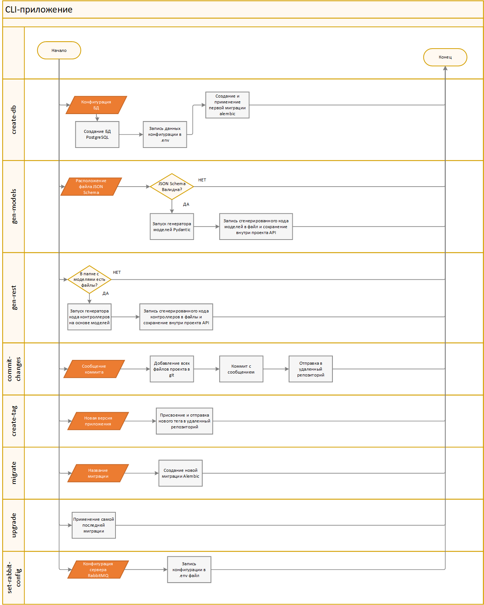
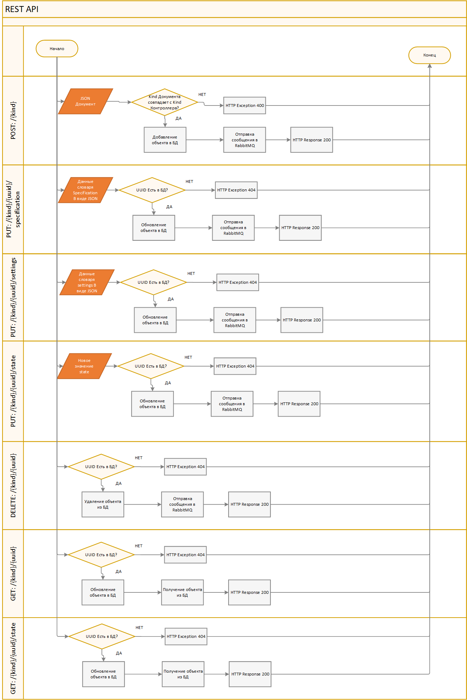
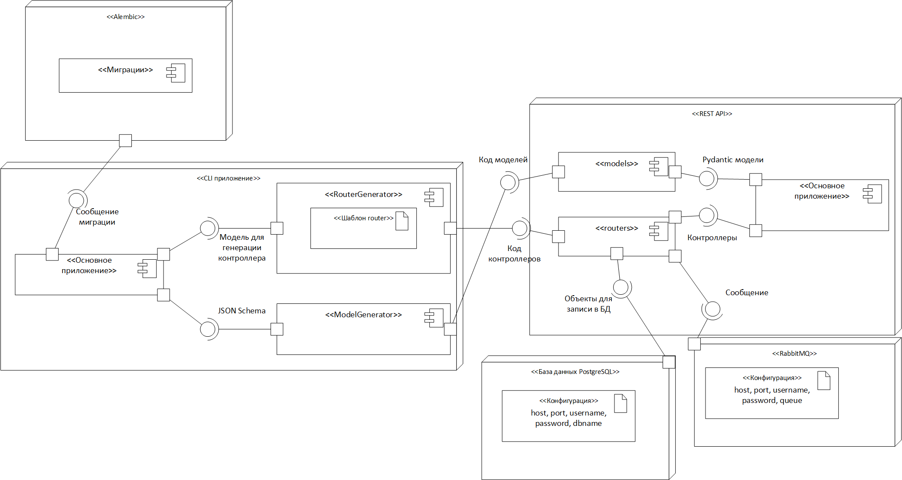
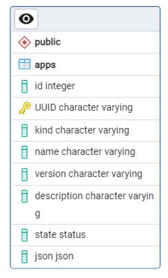

# CLI генератор Pydantic моделей и REST API контроллеров

## Обзор
Проект включает в себя CLI приложение, которое предоставляет набор инструментов для разработки и управления FastAPI проектом. Он же в свою очередь предоставляет интерфейс для взаимодействия с базой данных и системой сообщений.


## Возможности

CLI приложение позволяет:
- Генерировать Pydantic модели на основе их описания в виде JSON Schema
- Генерировать код контроллеров FastAPI REST приложения
- Создавать базу данных PostgresSQL
- Задавать конфигурацию заранее подготовленного RabbitMQ сервера, на который будут отправляться сообщения
- Создавать и применять миграции базы данных с помощью Alembic
- Сохранять изменения в удаленном репозитории Git
- Присваивать новую версию (tag) проекту с помощью Git


REST FastAPI приложение позволяет:
- Автоматически отправлять сообщения в брокер RabbitMQ после выполнения POST, PUT и DELETE запросов
- Добавлять в базу данных JSON документы, валидные к моделям, которые были сгенерированы через CLI приложение
- Изменять записи в базе данных
- Удалять записи из базы данных


## Стек технологий

- **Backend**: Python, FastAPI, PostgreSQL, SQLAlchemy, Alembic, Click, Pydantic, RabbitMQ
- **Frontend**: FastAPI Swagger

## Установка

1. Клонировать репозиторий

    ```bash
    git clone https://github.com/nsstnc/cli-fastapi-json.git
    cd cli-fastapi-json
    ```

2. Настроить виртуальное окружение

    ```bash
    python -m venv venv
    ```
   ```bash
    venv/bin/activate  # `venv/Scripts/activate` на Windows
    ```
3. Установить зависимости

   ```bash
    pip install -r requirements.txt
    ```

## Использование
### JSON Schema
Перед работой с приложением необходимо заранее подготовить JSON схемы для JSON объектов различных видов kind.
JSON схема описывает документы вида kind. Для каждой схемы нового вида kind создается модель Pydantic с тем же названием,
в дальнейшем на ее основе генерируются kind-контроллеры FastAPI приложения.  
Пример JSON схемы вида "mykind":
```json
{
  "$schema": "http://json-schema.org/draft-07/schema#",
  "type": "object",
  "properties": {
    "kind": {
      "type": "string",
      "maxLength": 32,
      "default": "mykind"
    },
    "name": {
      "type": "string",
      "maxLength": 128
    },
    "version": {
      "type": "string",
      "pattern": "^\\d+\\.\\d+\\.\\d+(-[a-zA-Z0-9]+(\\.[a-zA-Z0-9]+)*)?(\\+[a-zA-Z0-9]+(\\.[a-zA-Z0-9]+)*)?$"
    },
    "description": {
      "type": "string",
      "maxLength": 4096
    },
    "configuration": {
      "type": "object",
      "properties": {
        "specification": {
          "type": "object",
          "additionalProperties": true
        },
        "settings": {
          "type": "object",
          "additionalProperties": true
        }
      },
      "required": ["specification", "settings"]
    }
  },
  "required": ["kind", "name", "version", "description", "configuration"]
}
```
Генератор моделей заточен под схемы такого вида, где словари specification и settings задаются пользователем и имеют свободную структуру.
Также в схеме обязательно должны присутствовать поля kind, name, version и description. Иначе сгенерированная модель не будет валидна к таблице в БД.  
Пример JSON-документа, который валиден описанной выше схеме и Pydantic модели, сгенерированной на ее основе:
```json
{
  "kind": "mykind",
  "name": "hello-world",
  "version": "1.0.0",
  "description": "My application",
  "configuration": {
    "specification": {
      "jvmConfig": [
        "-Dcom.sun.a=a",
        "-Dcom.sun.b=b",
        "-Dcom.sun.c=c"
      ],
      "exposedPorts": [
        {
          "name": "my-port",
          "port": 8000,
          "protocol": "TCP"
        }
      ],
      "sharedNamespace": true,
      "log": {
        "level": "INFO"
      },
      "environmentVariables": [
        "VAR1=VALUE1"
      ]
    },
    "settings": {
    }
  }
}
```
Сгенерированные контроллеры FastAPI позволят работать с каждым видом kind добавленных моделей. Для каждого kind будут отдельные контроллеры GET, POST, PUT И DELETE запросов. 

### CLI
- Создание базы данных:
```bash
python cli/main.py create-db
```
Далее потребуется ввести конфигурационные данные для подключения к СУБД и создания базы данных.  
- Запись конфигурационных данных для RabbitMQ
```bash
python cli/main.py set-rabbit-config
```
- Генерация Pydantic моделей на основе JSON schema
```bash
python cli/main.py gen-models --json-schema=cli/schema.json
```
Где "cli/schema.json" - путь к файлу JSON Schema
- Генерация REST API контроллеров на основе добавленных Pydantic моделей
```bash
python cli/main.py gen-rest
```
- Сохранение и отправка изменений в удаленный репозиторий Git
```bash
python cli/main.py commit-changes --message="Initial commit"
```
Где "Initial commit" - описание коммита
- Присваивание тега новой версии приложения
```bash
python cli/main.py create-tag v0.0.1
```
- Создание миграции Alembic
```bash
python cli/main.py migrate --message="added record" 
```
- Применение всех миграций Alembic
```bash
python cli/main.py upgrade
```
- Подробную информацию обо всех командах можно посмотреть с помощью --help
```bash
python cli/main.py --help
```
### REST API
- Запуск сервера (После создания базы данных и добавления новых моделей/контроллеров)
```bash
./run_api.sh # `./run_api.bat` на Windows
```
Далее по адресу http://localhost:8001/docs можно использовать Swagger FastAPI, где описаны все возможные запросы к API.


## Архитектура проекта
### Flowchart диаграмма CLI-приложения

### Flowchart диаграмма REST API приложения

### Диаграмма развертывания

### Представление таблицы в Базе Данных


## Файловая структура
```
cli-fastapi-json/  
├── markdown-images/ # Папка с изображениями для README.md файла  
├── alembic/ # Папка с файлами alembic  
   └── versions/ # Миграции alembic
   └── env.py # Основной файл конфигурации Alembic
   └── README
   └── script.py.mako # Шаблон для новых файлов миграций
├── api/ # Директория FastAPI приложения
   └── models/ # Папка с Pydantic моделями
   └── routers/ # Папка с контроллерами REST API
   └── database.py # Файл с настройкой подключения к БД и генератором сессий
   └── db_models.py # SQLAlchemy модели для таблиц БД
   └── main.py # Основной файл FastAPI приложения
   └── rabbitmq.py # Файл с настройкой подключения к RabbitMQ и методами для отправки сообщений
├── cli/ # Директория CLI приложения
   └── create_database.py # Скрипт, для создания базы данных PostgreSQL
   └── main.py # Основной файл CLI приложения
   └── ModelGenerator.py # Класс-генератор моделей Pydantic
   └── router_template.py.jinja # Jinja шаблон контроллеров для FastAPI приложения
   └── RouterGenerator.py # Класс-генератор контроллеров FastAPI
├── venv/ # Файлы виртуального окружения
├── .env # Файл с переменными окружения (записан в .gitignore и создается автоматически)  
├── .gitignore
├── alembic.ini # Конфигурация alembic
├── README.md # Документация
├── requirements.txt # Файл с зависимостями
├── run_api.bat # Скрипт для запуска приложения Fast API на Windows
├── run_api.sh # Скрипт для запуска приложения Fast API на UNIX-системах
```
